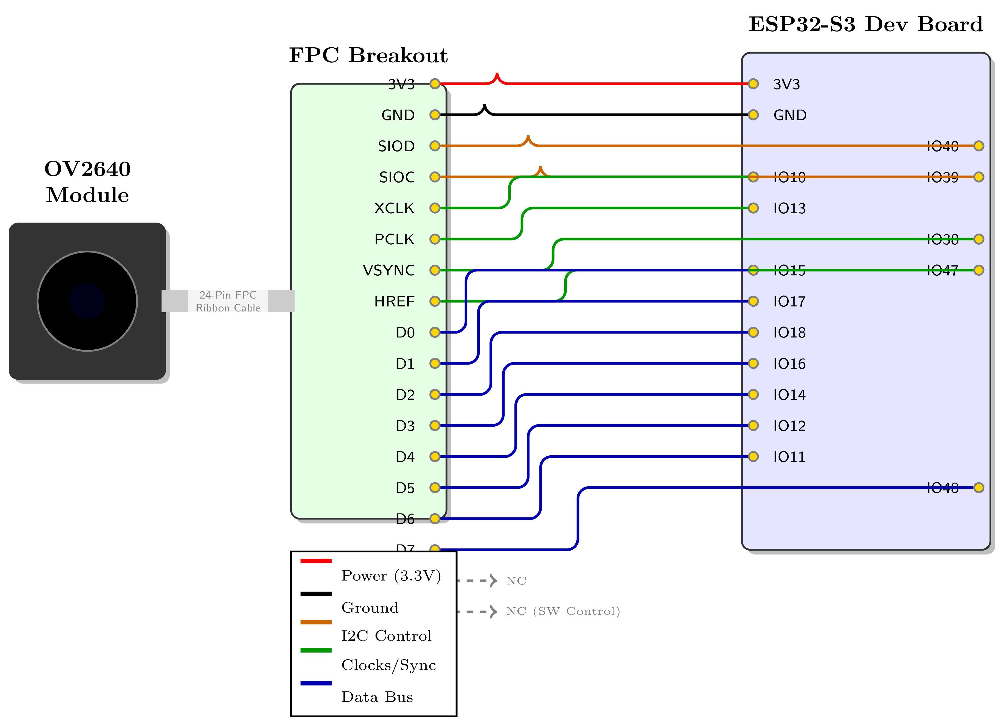
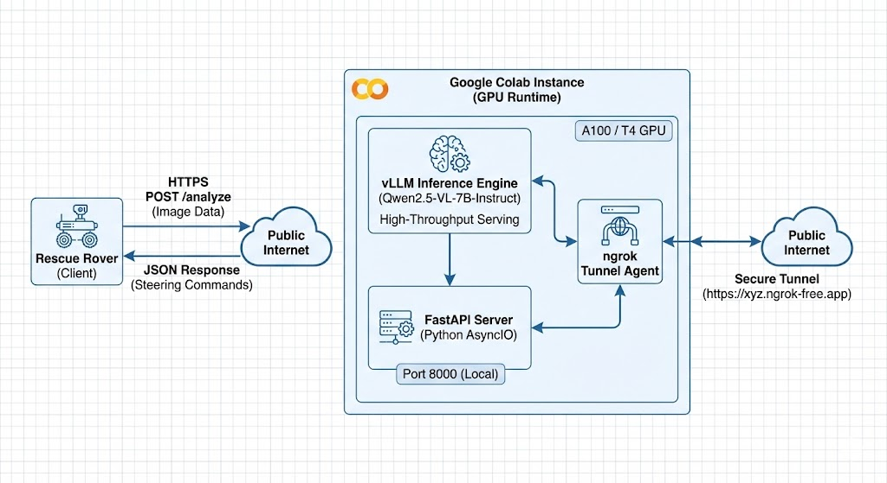
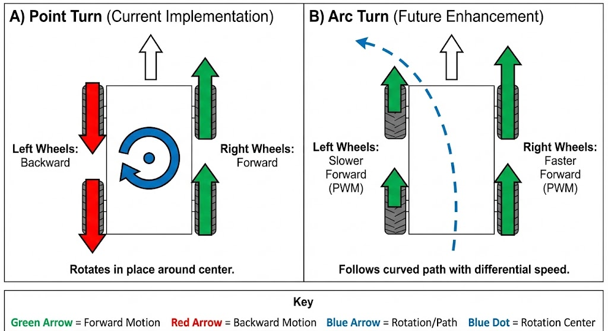

# Rescue Rover
[](LICENSE)
[](https://www.espressif.com/)
[](https://ultralytics.com/)
[](https://research.google.com/colaboratory/)
[](https://www.python.org/)

We built a low cost (1.1 mil VND ≈ 42 USD) self driving rover using an **ESP32 S3** and **ESP NOW** network protocols for instructions communication between the station (ESP CH340 Plugged in a Mac Air M2) with the driver controller (ESP32 S3). It pairs **YOLO** for immediate obstacle avoidance with a cloud based architecture where **Qwen2.5** handles continuous VLM visual decision making and deeper semantic scene analysis.

---

## Gallery & Demos

### System Hardware
<p align="center">
  
  
</p>
<p align="center">
  <b>Left:</b> The assembled prototype. <b>Right:</b> Physical wiring schematic.
</p>

### Architecture
<p align="center">
  
</p>

---

### Video Demos

| **Autonomous Navigation** |
|:-------------------------:|
| [](https://www.youtube.com/shorts/YxF6a_McdHY) |
| *Qwen2.5 VL successfully guiding the rover.* |

<br>

| **The Headspin Failure Case** |
|:---------------------------------:|
| [](https://www.youtube.com/shorts/sCFix-REja4) |
| *Using a heavy phone for high quality video transmission caused the rover to spin uncontrollably.* |

> The "Headspin" clip is a funny scenario during demo. We discuss thermal limits and prompt engineering in Chapters 3 and 6 of the [report](./Rescue_Rover_Report/main.pdf), but those sections do not capture the physics of mounting a heavy smartphone on a lightweight chassis. The uneven weight distribution caused the front to dip, triggering a feedback loop where the rover endlessly inspected its own tires while spinning. We eventually fixed this in the success video by taping a heavy charging dock to the rear as a counterweight.
---

## System Architecture

The architecture allows heavy model inference without compromising real time motor control. Processing is distributed across three tiers:

### 1. Firmware, Hardware, Physical layer
*   **Device:** ESP32-S3
*   **Function:** Handles motor PWM, UDP video streaming, and ultrasonic safety overrides.
*   **Latency:** < 10ms
*   **Failsafe:** Can trigger an emergency stop independently of the host connection.

### 2. Station
*   **Device:** Windows/Mac PC
*   **Function:** Runs the operator dashboard and **YOLOv8-Nano** for object detection (people, furniture).
*   **Latency:** ~30ms via WiFi (UDP).

### 3. Cloud
*   **Device:** Remote GPU instance (Colab/GCP)
*   **Function:** Runs **Qwen2.5-VL-7B** for detailed scene understanding. The host sends frames via an HTTP tunnel (ngrok) when the local navigation logic yields low confidence.
*   **Latency:** ~1.5s via HTTP.

---

## Hardware Specifications

The platform is built on a standard 4WD chassis with off-the-shelf modules.

| Component | Specification |
| :--- | :--- |
| **Microcontroller** | ESP32-S3 WROOM (Dual Core 240MHz, 8MB PSRAM) |
| **Camera** | OV2640 (configured for 320x240 streaming) |
| **Motor Driver** | L298N Dual H-Bridge |
| **Actuation** | 4x TT Gear Motors (1:48 ratio, 6V) |
| **Power** | 3S LiPo Battery (11.1V, 2200mAh) |

---

## Software Stack

*   **Firmware:** Arduino Framework (C++)
*   **Host Application:** Python 3.10, NiceGUI, OpenCV
*   **AI/ML:**
    *   YOLOv8 (Ultralytics) for detection
    *   Qwen2.5-VL (vLLM) for visual reasoning

---

## Setup & Installation

### 1. Firmware Flash
The system requires two ESP32 units: one for the Rover and one acting as a Gateway (USB dongle).
1. Flash `firmware/rover_code.ino` to the **ESP32-S3**.
2. Flash `firmware/gateway_code.ino` to the standard **ESP32**.
3. *Update the MAC addresses in both files before uploading.*

### 2. Host Application
Connect the Gateway ESP32 to the host PC via USB.

```bash
# Install Python dependencies
pip install -r requirements.txt

# Launch the dashboard
python main_controller.py
```

### 3. Cloud Backend (Optional)
To enable the Vision Language Model features:
1. Run the notebook in `cloud/inference_server.ipynb` on a GPU instance
2. Configure the `ngrok` URL in the dashboard settings

#### Or you can just run it locally, its a 7B model
---

## Diagram Gallery (Additional)

<p align="center">
  
  <br>
  <b>Fig 3:</b> Comparison of point turn (current implementation) versus arc turn (future enhancement).
</p>

---

## The Team
| Name | Role |
|------|------|
| **Ngo Thanh Trung** | Team Leader / AI Engineer |
| **Pham Thai Duong** | Hardware Design / Firmware |
| **Nguyen Duy Duc** | Frontend / Dashboard Integration |
| **Le Quang Huy** | Connection Design|
